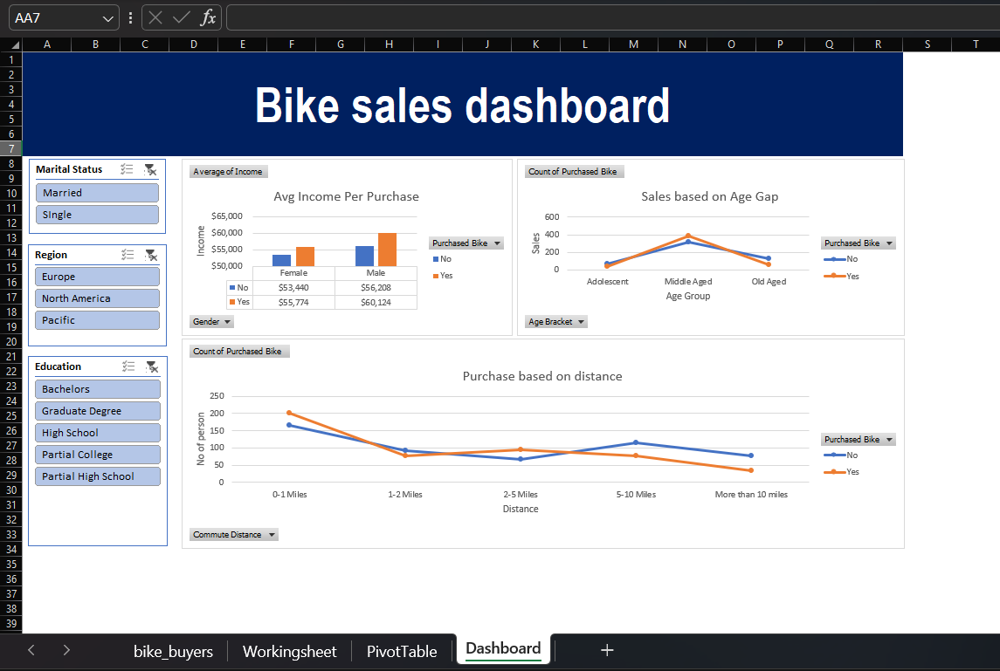

# 🚲 Bike Sales Dashboard

An interactive Excel dashboard designed to analyze the factors that influence a customer's decision to buy a bicycle. This project uses dynamic charts and filters to uncover customer trends based on demographics and lifestyle choices.

---

### 📊 What This Dashboard Shows

Looking at the file named "Screenshot 2026-05-24 085819.png", the dashboard tracks three main areas:
* **Avg Income Per Purchase:** A bar graph showing that customers with higher average incomes (both male and female) are more likely to buy a bike.
* **Sales Based on Age Gap:** A line graph showing that **Middle Aged** individuals buy the most bikes compared to adolescents and older people.
* **Purchase Based on Distance:** A line graph showing that people with a short commute distance (**0–1 Miles**) buy the most bikes.

---

### 🛠️ Key Features Used

* **Interactive Slicers:** Added buttons on the left to filter the data instantly by **Marital Status**, **Region** (Europe, North America, Pacific), and **Education**.
* **Pivot Tables:** Built back-end summary sheets to easily calculate count tallies and income averages.
* **Data Categorization:** Grouped raw numbers into easy-to-read brackets like age groups and distance miles.

---

---

### 🚀 How to Try It

1. Download the Excel file from this repository.
2. Open it up and click on the **Dashboard** sheet.
3. Click any button in the blue boxes on the left to see the charts automatically change and move!
